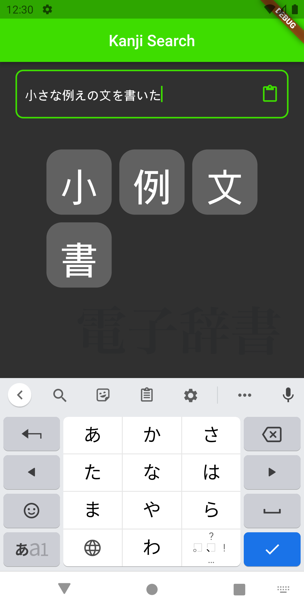

[![CircleCI Status][circleci-badge]][circleci]

  

# Jisho Study tool
A japanese dictionary with features for making studying the language easier. For the time being, it's mostly a frontend for [Jisho.org][jisho]. It is still in beta, and will stay in beta for some time. Its main data source is the [unofficial_jisho_api][unofficial_jisho_api].

## Screenshots

  
   
  

  
   
  

[See all screenshots][screenshots]

## Search

Search using the Jisho API.
This returns the same Jisho search results you would find by default search without any modifiers (like `#kanji` or `#adverbs`).
There is also an `Extensive search` mode which does another request to fetch detailed information, at the expense of keeping the user waiting.
This detailed information might include example sentences, audio, and other supplementary information.

## Kanji Search

There's several ways to search for kanji.
You can search for kanji manually, by typing it in (or by choosing from a large copy-pasted message).
You can also search for kanji by trying to draw it.
There's also grade based search, and radical based search.
The data returned usually includes the kanjis radical, meanings, pronounciations, stroke order, some statistics and example usage.

# Development environment

To set up a development environment, I would suggest heading over to [flutter.dev][flutter-get-started] and following the installation instructions.

Apart from that, there is no other tools being used at the current time.

## Aim

Why am I making this application, when there's thousands of japanese dictionary apps out there?

I've spent quite a lot of time studying this language.
During study sessions, most of my time would go towards looking for information.
I would often come across new kanji for which I don't know the stroke order, so I ended up fighting with the handwriting recognizers.
Sometimes, I was looking at a word where I had some translations for the word, but no idea how to actually use it.
Finding words that were worthwile to learn could also be hard, and I've probably memorized a bunch of uncommon words that people don't really use.
I also frequently went to places without access to the internet.

To resolve these problems, I've tried several study aiding apps.
Most were good in some ways, but there wasn't really any app that filled all my requirements.
Jisho.org however, provides most of my needs.
There was a lot of Jisho.org apps, but most were missing a lot of the features that were critical to me.
That is the main problem this app is trying to solve.
I'm aiming to make the app I wished I had while studying.

## Thanks to

- Kim, Miwa and Andrew, who did the absolutely incredible work of making Jisho.org
- Mistvall, who created the original API library [unofficial-jisho-api][unofficial-jisho-api].

[circleci-badge]: https://circleci.com/gh/h7x4ABk3g/Jisho-Study-Tool.svg?style=shield
[circleci]: https://app.circleci.com/pipelines/github/h7x4ABk3g/Jisho-Study-Tool
[flutter-get-started]: https://docs.flutter.dev/get-started/install
[jisho]: https://jisho.org
[screenshots]: .github/screenshots/
[unofficial-jisho-api]: https://www.npmjs.com/package/unofficial-jisho-api
[unofficial_jisho_api]: https://pub.dev/packages/unofficial_jisho_api